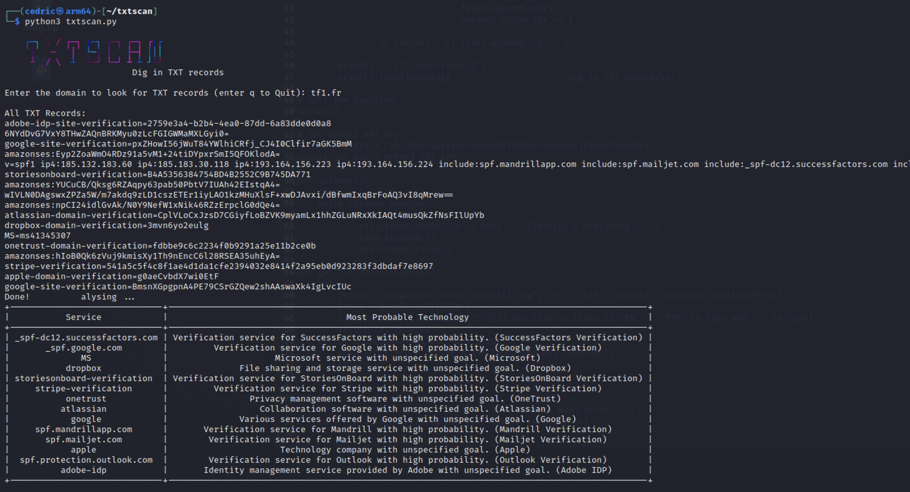

# TxtScan
 

## Purpose
TxtScan is a small tool that simply cleans up the TXT results returned by a DIG query. Following this, duplicates are removed and a call to the GPT chat API is made to display a brief description of the service or services present. This allows for a quick snapshot of certain technologies used for a given domain.

## Preview
[]

## Contributions
Pull requests are welcome, i'm not developper :P